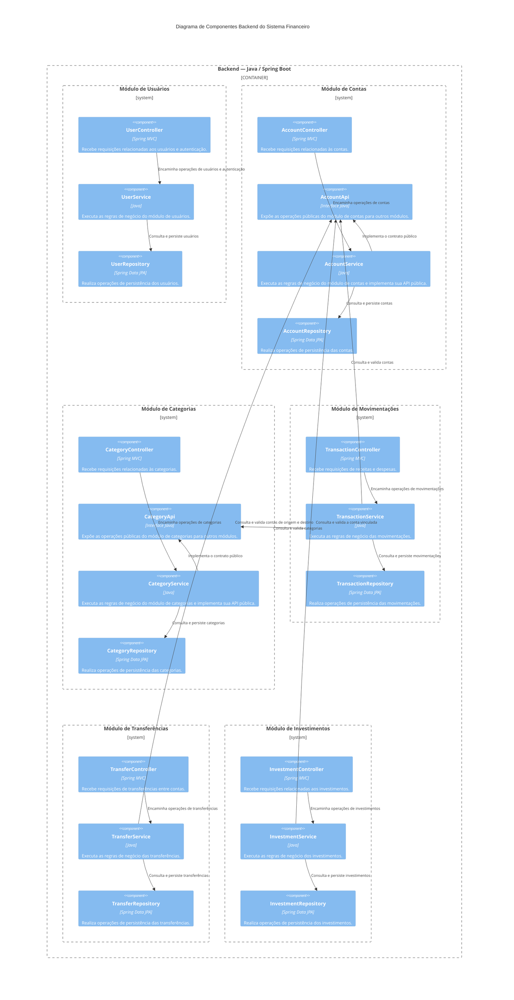

# Diagrama de Componentes (C4 nível 3)

```mermaid
C4Component
    title Diagrama de Componentes Backend do Sistema Financeiro
    Container_Boundary(backend, "Backend — Java / Spring Boot") {
        Boundary(users, "Módulo de Usuários") {
            Component(userController, "UserController", "Spring MVC", "Recebe requisições relacionadas aos usuários e autenticação.")
            Component(userService, "UserService", "Java", "Executa as regras de negócio do módulo de usuários.")
            Component(userRepository, "UserRepository", "Spring Data JPA", "Realiza operações de persistência dos usuários.")
        }
        Boundary(accounts, "Módulo de Contas") {
            Component(accountController, "AccountController", "Spring MVC", "Recebe requisições relacionadas às contas.")
            Component(accountApi, "AccountApi", "Interface Java", "Expõe as operações públicas do módulo de contas para outros módulos.")
            Component(accountService, "AccountService", "Java", "Executa as regras de negócio do módulo de contas e implementa sua API pública.")
            Component(accountRepository, "AccountRepository", "Spring Data JPA", "Realiza operações de persistência das contas.")
        }
        Boundary(categories, "Módulo de Categorias") {
            Component(categoryController, "CategoryController", "Spring MVC", "Recebe requisições relacionadas às categorias.")
            Component(categoryApi, "CategoryApi", "Interface Java", "Expõe as operações públicas do módulo de categorias para outros módulos.")
            Component(categoryService, "CategoryService", "Java", "Executa as regras de negócio do módulo de categorias e implementa sua API pública.")
            Component(categoryRepository, "CategoryRepository", "Spring Data JPA", "Realiza operações de persistência das categorias.")
        }
        Boundary(transactions, "Módulo de Movimentações") {
            Component(transactionController, "TransactionController", "Spring MVC", "Recebe requisições de receitas e despesas.")
            Component(transactionService, "TransactionService", "Java", "Executa as regras de negócio das movimentações.")
            Component(transactionRepository, "TransactionRepository", "Spring Data JPA", "Realiza operações de persistência das movimentações.")
        }
        Boundary(transfers, "Módulo de Transferências") {
            Component(transferController, "TransferController", "Spring MVC", "Recebe requisições de transferências entre contas.")
            Component(transferService, "TransferService", "Java", "Executa as regras de negócio das transferências.")
            Component(transferRepository, "TransferRepository", "Spring Data JPA", "Realiza operações de persistência das transferências.")
        }
        Boundary(investments, "Módulo de Investimentos") {
            Component(investmentController, "InvestmentController", "Spring MVC", "Recebe requisições relacionadas aos investimentos.")
            Component(investmentService, "InvestmentService", "Java", "Executa as regras de negócio dos investimentos.")
            Component(investmentRepository, "InvestmentRepository", "Spring Data JPA", "Realiza operações de persistência dos investimentos.")
        }
    }
    Rel(userController, userService, "Encaminha operações de usuários e autenticação")
    Rel(userService, userRepository, "Consulta e persiste usuários")
    Rel(accountController, accountService, "Encaminha operações de contas")
    Rel(accountService, accountRepository, "Consulta e persiste contas")
    Rel(accountService, accountApi, "Implementa o contrato público")
    Rel(categoryController, categoryService, "Encaminha operações de categorias")
    Rel(categoryService, categoryRepository, "Consulta e persiste categorias")
    Rel(categoryService, categoryApi, "Implementa o contrato público")
    Rel(transactionController, transactionService, "Encaminha operações de movimentações")
    Rel(transactionService, transactionRepository, "Consulta e persiste movimentações")
    Rel(transactionService, accountApi, "Consulta e valida contas")
    Rel(transactionService, categoryApi, "Consulta e valida categorias")
    Rel(transferController, transferService, "Encaminha operações de transferências")
    Rel(transferService, transferRepository, "Consulta e persiste transferências")
    Rel(transferService, accountApi, "Consulta e valida contas de origem e destino")
    Rel(investmentController, investmentService, "Encaminha operações de investimentos")
    Rel(investmentService, investmentRepository, "Consulta e persiste investimentos")
    Rel(investmentService, accountApi, "Consulta e valida a conta vinculada")
```