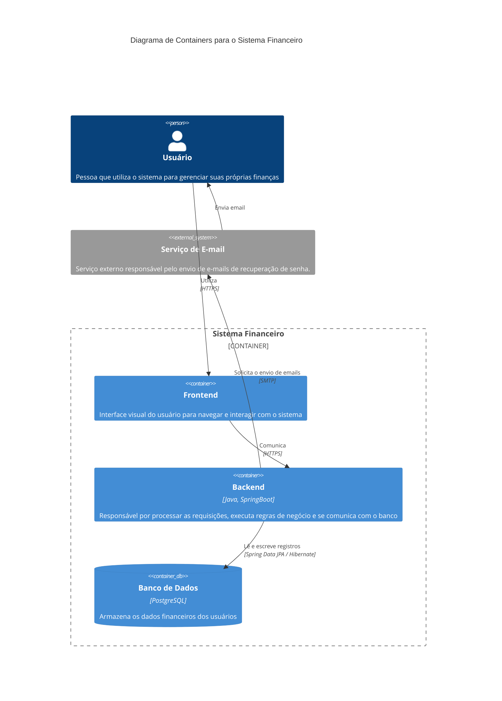

# Diagrama de Containers (C4 nível 2)

```mermaid
C4Container
    title Diagrama de Containers para o Sistema Financeiro
    Person(customer, "Usuário", "Pessoa que utiliza o sistema para gerenciar suas próprias finanças")
    Container_Boundary(c0, "Sistema Financeiro") {
        Container(front, "Frontend", "", "Interface visual do usuário para navegar e interagir com o sistema")
        Container(back, "Backend", "Java, SpringBoot", "Responsável por processar as requisições, executa regras de negócio e se comunica com o banco")
        ContainerDb(database, "Banco de Dados", "PostgreSQL", "Armazena os dados financeiros dos usuários")
    }
    System_Ext(system_ext, "Serviço de E-mail", "Serviço externo responsável pelo envio de e-mails de recuperação de senha.")
    Rel(customer, front, "Utiliza", "HTTPS")
    Rel(front, back, "Comunica", "HTTPS")
    Rel(back, database, "Lê e escreve registros", "Spring Data JPA / Hibernate")
    Rel(back, system_ext, "Solicita o envio de emails", "SMTP")
    Rel(system_ext, customer, "Envia email")
```