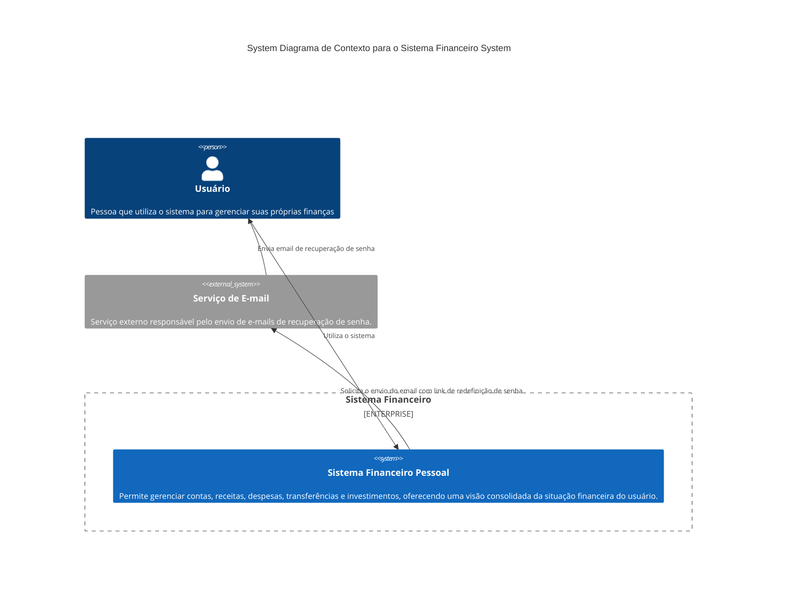

# Diagrama de contexto (C4 nível 1)

```mermaid
C4Context
    title System Diagrama de Contexto para o Sistema Financeiro System
    Person(customerA, "Usuário", "Pessoa que utiliza o sistema para gerenciar suas próprias finanças")
    Enterprise_Boundary(b0, "Sistema Financeiro") {
        System(SystemAA, "Sistema Financeiro Pessoal", "Permite gerenciar contas, receitas, despesas, transferências e investimentos, oferecendo uma visão consolidada da situação financeira do usuário.")
    }
    System_Ext(SystemC, "Serviço de E-mail", "Serviço externo responsável pelo envio de e-mails de recuperação de senha.")
    Rel(customerA, SystemAA, "Utiliza o sistema")
    Rel(SystemAA, SystemC, "Solicita o envio do email com link de redefinição de senha")
    Rel(SystemC, customerA, "Envia email de recuperação de senha")
```